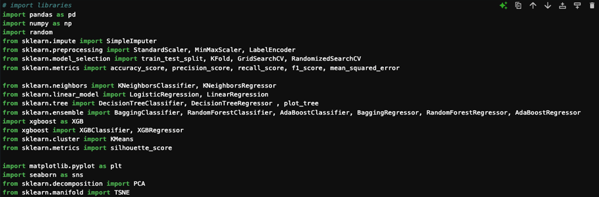
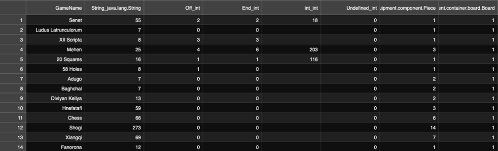
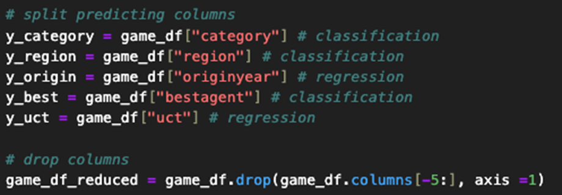
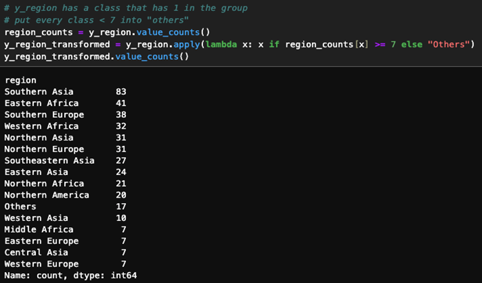
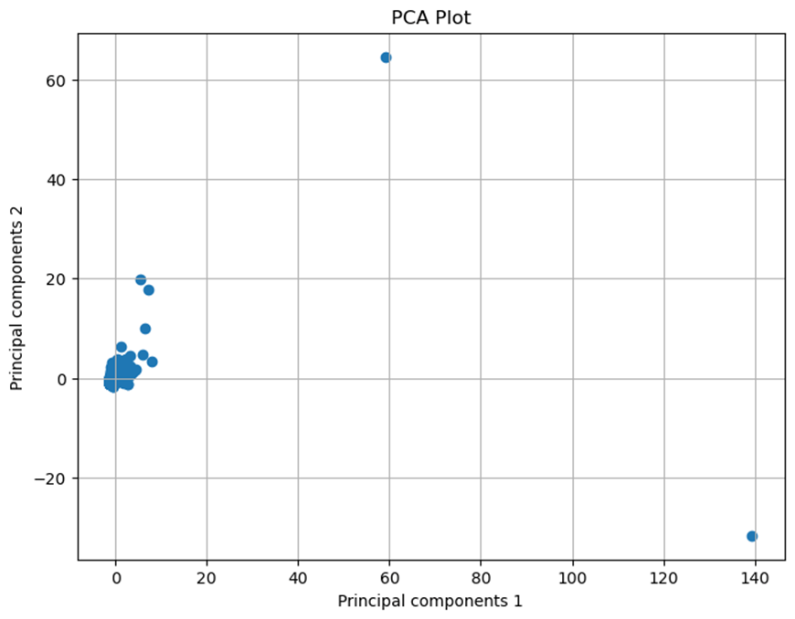
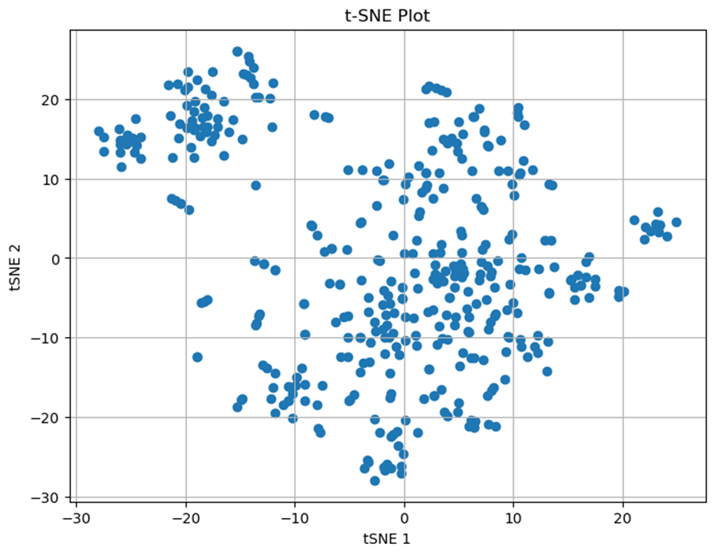
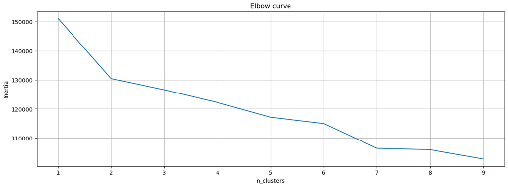

# ludii_boardgame_ml
## Introduction 
This report aims to make prediction of board games data set which has 403 rows and 386 columns. The purpose of this report is to predict 5 labels which are 
1.	Category: A high-level taxonomy used to organise games
2.	Region: The region of the world where this game originates
3.	OriginYear: The year where this game was first recorded 
4.	BestAgent: The best currently available AI for playing this game
5.	UCT: The average win-rate of a simple UCT-based game playing AI
We will employ the best-performing trained models from our analysis to make predictions on five new, unseen data points. The machine learning algorithms utilized include K-Nearest Neighbors (KNN), Linear Models, Decision Trees, and Ensemble Learning methods such as Bagging, Pasting, Random Forest, and Boosting. Performance metrics used are accuracy for classification models and mean squared error (MSE) for regression models.

## Data preprocessing 
This analysis begins by importing the necessary libraries (see Appendix, Figure 1). and reading the CSV file GameData.csv into a DataFrame named game_df (see Appendix, Figure 2). After inspecting for null values, we find that the int_int column has 389 missing values out of 403, rendering it ineffective for analysis. 
This will be overcome by dropping column approach as well as GameName columns that would not be affect to the predicting model and there are several missing values from other columns which leveraged by mean imputation. 
This report also prepares the dataset for each predictive label by appropriately splitting the columns (see Appendix, Figure 3). During this process, we notice that the Region label has classes with very few records, some with only a single data point. To mitigate class imbalance, we combine all classes with fewer than seven records into an “Others” category (see Appendix, Figure 4).

## Exploratory Data Analysis and Clustering
This analysis uses Principal Component Analysis (PCA) approach to reduce multiple dimensions to 2 dimensions for easier visualise to human eyes, but the plot has few outliers this is because PCA has a limitation to handle with the outlier (see Appendix, Figure 5). Then, we try t-SNE approach instead to visualise (see Appendix, Figure 6).
To observe clustering from game dataset, this report utilises k-mean clustering and elbow curve method to find how many clusters it should have in this data set (see Appendix, Figure 7).
This elbow curve shows k = 2 is the best for clustering number. We will use n_clusters = 2 and apply it to t-SNE plot (see Appendix, Figure 8).
The plot shows 2 clusters, the blue circle in the plot identifies a potential outlier or a unique game that lies outside the main distribution of the cluster. This could suggest that the game has characteristics or features that significantly differ from most games in the dataset. 

## Model Evaluation
This section this analysis will perform prediction by leveraging machine learning algorithms. The section will split the prediction into two parts, Classification models and Regression models. 

## Classification Models
The section will predict categorical labels which are game category, best agent, and region. The algorithms used are K-Nearest Neighbours Classifier, Logistic Regression, Decision Tree Classifier, and Ensemble Learning models. Also, the model will utilise K-fold cross validation to prevent overfitting model.
The data for testing will be held 20%, we encode the predicting data to transform string to numerical data and use standard scale to standardise the data. In this approach will also use benefit of Gridsearch to optimum the best fit hyperparameters for each algorithm. Finally, we measure the performance every model with accuracy.

### Predicting Category
•	Best Model: AdaBoost Classifier with 100 estimators achieved the highest accuracy of 97.53% (Appendix, Table 1).
•	Discussion: The ensemble methods, particularly AdaBoost, outperformed other algorithms due to their ability to combine weak learners to form a strong classifier. The high accuracy indicates that the model effectively captured the underlying patterns in the data.
### Predicting BestAgent
•	Best Model: Decision Tree Classifier with specific hyperparameters achieved an accuracy of 58.02% (Appendix, Table 2).
•	Discussion: The moderate accuracy suggests that predicting BestAgent is more challenging, possibly due to overlapping features among classes. In the process, there are 3 models with the same result we decide to use the simplest model to be the best perform.
### Predicting Region
•	Best Model: XGBoost Classifier with 100 estimators achieved the highest accuracy of 43.21% (Appendix, Table 3).
•	Discussion: The lower accuracy reflects the complexity and potential overlap of features among regions. XGBoost’s gradient boosting approach helped improve performance over other models, but the results indicate that data might not have the strong correlation between the ludeme score and region.

## Regression Models
This section will predict numerical labels, such as the game’s origin year and UCT. The algorithms used are K-Nearest Neighbors Regressor, Linear Regression, Decision Tree Regressor, and various Ensemble Learning models. The model will also employ K-fold cross-validation to mitigate the risk of overfitting.

The test data will be held at 20%, and the target values are numerical. We encode categorical variables and scale the numerical features using standard scaling. The model parameters will be tuned using GridSearchCV to find the optimal hyperparameters for each algorithm. Lastly, the performance of each model will be evaluated using the mean squared error (MSE). Below are the summary tables for the regression models.

### Predicting OriginYear
•	Best Model: Random Forest Regressor with 50 estimators and specific hyperparameters achieved the lowest MSE of 949,095.54 (Appendix, Table 4).
•	Discussion: The Random Forest model effectively reduced variance and improved prediction accuracy. However, the high MSE indicates that predicting OriginYear is challenging, potentially due to wide variability and historical inaccuracies in the data.
Predicting UCT
•	Best Model: KNN Regressor with cosine metric and 10 neighbours achieved the lowest MSE of 101.19 (Appendix, Table 5).
•	Discussion: The KNN model performed best, suggesting that similar games have similar UCT scores. The use of the cosine metric improved performance by capturing the similarity in the high-dimensional feature space.

## Model Performance 
To conclude the performance on each predicting model will be shown in the model’s performance summary table.

Predicting Labels	ML Models	Best Hyperparameters	Accuracy/MSE
Category	AdaBoost Classifier	{'n_estimators': 100}	0.9753
Best Agent	RandomForest Regression	{'criterion': 'gini', 'max_depth': 10, 'max_leaf_nodes': 10, 'min_samples_leaf': 1, 'min_samples_split': 2}	0.5802
Region	XGBoost Classifier	{'n_estimators': 100}	0.4321
Origin Year	RandomForest Regression	{'criterion': 'squared_error', 'max_features': 'sqrt', 'min_samples_leaf': 5, 'n_estimators': 50}	949095.5355
Uct	KNeighbors Regression	{'metric': 'cosine', 'n_neighbors': 10, 'weights': 'distance'}	101.1923

## Prediction outcome
Using the best-performing models, we make predictions on the new dataset GameData_predictions after preprocessing (dropping GameName and int_int columns). The predicted labels are:
1.	Category: ['Hunt', 'War', 'Race', 'Sow', 'Space']
2.	Best Agent: ['Alpha-Beta', 'Alpha-Beta', 'Alpha-Beta', 'Alpha-Beta', 'Alpha-Beta']
3.	Region: ['Southern Asia', 'Southern Europe', 'Northern Europe', 'Eastern Africa', 'Eastern Africa']
4.	Origin Year: [1781., 1860., 1508., 1931., 1826.]
5.	Uct: [50.34, 52., 58.22, 55.08, 64.6]

Appendix

Figure 1. Imported Libraries for this analysis.

Figure 2. Samples GameData.csv

Figure 3. Splitting predicting data

Figure 4. New grouping to “Others” class

Figure 5. Principal Component Analysis Plot.

Figure 6. t-SNE Plot

Figure 7. Elbow plot to see how many clusters game data set should have

Figure 8. Applying k-mean clustering into t-SNE Plot

Table 1. Predicting Category		
ML Models	Best Hyperparameters	Accuracy
KNeighbors Classification	{'metric': 'manhattan', 'n_neighbors': 3, 'weights': 'distance'}	0.9136
Logistic Regression	{'C': 1, 'max_iter': 1000, 'solver': 'lbfgs'}	0.9259
DecisionTree Classification	{'criterion': 'gini', 'max_depth': 10, 'max_leaf_nodes': 30, 'min_samples_leaf': 1, 'min_samples_split': 2}	0.9506
Bagging Classification	{'bootstrap': True, 'n_estimators': 50}	0.9630
Pasting Classification	{'bootstrap': False, 'n_estimators': 100}	0.9383
RandomForest Classification	{'criterion': 'entropy', 'max_features': 'sqrt', 'min_samples_leaf': 5, 'n_estimators': 100}	0.9383
AdaBoost Classification	{'n_estimators': 100}	0.9753
XGBoost Classification	{'n_estimators': 50}	0.9506

Table 2. Predicting Best Agent 	
ML Models	Best Hyperparameters	Accuracy
KNeighbors Classification	{'metric': 'cosine', 'n_neighbors': 50, 'weights': 'distance'}	0.5062
Logistic Regression	{'C': 0.05, 'max_iter': 1000, 'solver': 'lbfgs'}	0.5556
DecisionTree Classification	{'criterion': 'gini', 'max_depth': 10, 'max_leaf_nodes': 10, 'min_samples_leaf': 1, 'min_samples_split': 2}	0.5802
Bagging Classification	{'bootstrap': True, 'n_estimators': 100}	0.5802
Pasting Classification	{'bootstrap': False, 'n_estimators': 10}	0.5802
RandomForest Classification	{'criterion': 'gini', 'max_features': 'sqrt', 'min_samples_leaf': 5, 'n_estimators': 100}	0.5556
AdaBoost Classification	{'n_estimators': 100}	0.5679
XGBoost Classification	{'n_estimators': 50}	0.5556

Table 3. Predicting Region 		
ML Models	Best Hyperparameters	Accuracy
KNeighbors Classification	{'metric': 'manhattan', 'n_neighbors': 3, 'weights': 'distance'}	0.3827
Logistic Regression	{'C': 0.05, 'max_iter': 1000, 'solver': 'liblinear'}	0.4074
DecisionTree Classification	{'criterion': 'gini', 'max_depth': 15, 'max_leaf_nodes': 30, 'min_samples_leaf': 3, 'min_samples_split': 2}	0.358
Bagging Classification	{'bootstrap': True, 'n_estimators': 50}	0.3951
Pasting Classification	{'bootstrap': False, 'n_estimators': 50}	0.358
RandomForest Classification	{'criterion': 'entropy', 'max_features': 'sqrt', 'min_samples_leaf': 5, 'n_estimators': 50}	0.358
AdaBoost Classification	{'n_estimators': 50}	0.4074
XGBoost Classification	{'n_estimators': 100}	0.4321

Table 4. Predicting Origin Year	
ML Models	Best Hyperparameters	MSE
KNeighbors Regression	{'metric': 'cosine', 'n_neighbors': 10, 'weights': 'distance'}	1000699.44
Linear Regression	None	4.176e+30
DecisionTree Regression	{'criterion': 'squared_error', 'max_depth': 10, 'max_leaf_nodes': 10, 'min_samples_leaf': 1, 'min_samples_split': 2}	1285783.45
Bagging Regression	{'bootstrap': True, 'n_estimators': 100}	1012084.77
Pasting Regression	{'bootstrap': False, 'n_estimators': 10}	1148410.04
RandomForest Regression	{'criterion': 'squared_error', 'max_features': 'sqrt', 'min_samples_leaf': 5, 'n_estimators': 50}	949095.536
AdaBoost Regression	{'n_estimators': 50}	1021991.04
XGBoost Regression	{'n_estimators': 10}	1065691.23

Table 5. Predicting Uct		
ML Models	Best Hyperparameters	MSE
KNeighbors Regression	{'metric': 'cosine', 'n_neighbors': 10, 'weights': 'distance'}	101.1923
Linear Regression	None	4.757e+26
DecisionTree Regression	{'criterion': 'absolute_error', 'max_depth': 10, 'max_leaf_nodes': 10, 'min_samples_leaf': 3, 'min_samples_split': 2}	115.2118
Bagging Regression	{'bootstrap': True, 'n_estimators': 50}	113.1746
Pasting Regression	{'bootstrap': False, 'n_estimators': 50}	113.1687
RandomForest Regression	{'criterion': 'absolute_error', 'max_features': 'sqrt', 'min_samples_leaf': 5, 'n_estimators': 100}	111.0799
AdaBoost Regression	{'n_estimators': 100}	112.4652
XGBoost Regression	{'n_estimators': 10}	118.8444